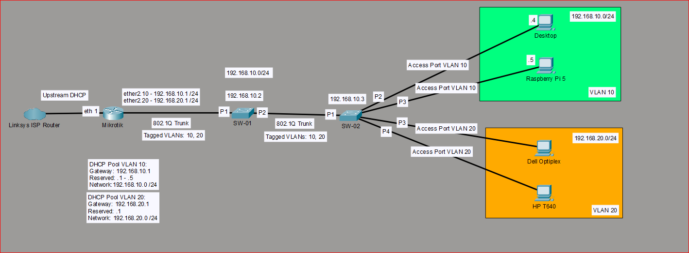

# hybrid-infrastructure-lab

## Overview

A self-hosted enterprise-style hybrid lab designed to develop practical skills in networking, observability, Linux administration, virtualisation and cloud-integrated operations.

This project aims to develop practical hands-on experience in:

- Network planning, implementation and management
- Routing, switching and VLAN segmentation
- Observability and monitoring
- Linux administration
- Virtualisation and self-hosted services
- Cloud-integrated and hybrid environments
- Troubleshooting and operational workflows
- Documentation and architecture design

---

## Current Infrastructure

### Hardware

- Raspberry Pi 5
- MikroTik RB760iGS Router
- 2x TP-Link TL-SG605E Managed Switches
- Dell OptiPlex 3040
- HP t640 Thin Client
- ESP32 Development Kit
- Desktop Workstation
- Laptop Test Device

### Core Technologies

- Grafana
- Prometheus
- Pi-hole
- Docker
- Docker Compose
- Proxmox VE
- AWS CloudWatch
- MikroTik RouterOS
- Python
- Paramiko

### Network Design

- The lab network is built around a MikroTik RB760iGS router with 2x TP-Link TL-SG605E Managed Switches
- The lab uses "Router on a Stick" (ROAS) with managed L2 switching and VLAN segmentation
- 802.1Q VLAN trunking between managed switches
- Dedicated DHCP scopes per VLAN
- VLAN 10 - Main (trusted devices) 
- VLAN 20 - Isolated (new device onboarding)
- Automated MikroTik configuration backup to support rollback and recovery of router
- Implemented dedicated management subnet for router and switch configurations

#### Network Security & Hardening

- Restricted WinBox and SSH administrative access to the trusted management VLAN only
- Restricted access from onboarding vlan to management vlan while still preserving DNS, DHCP and internet connectivity
- Enforced inter-vlan isolation using MikroTik firewall filtering rules
- Hardened management-plane exposure by restricting MikroTik Neighbor Discovery and MAC-based management services
- Disabled unnecessary legacy management services including Telnet and FTP
- Maintained isolated lab environment separated from the primary home network infrastructure

#### Network Goals

- Separate trusted infrastructure from newly onboarded and testing devices
- Reduce risk when onboarding used or untrusted hardware into the lab
- Simulate enterprise-style network segmentation
- Support future virtualisation and security tooling
- Maintain operational stability of both home network and lab network during staged infrastructure changes

#### Operational Approach

- Implement changes to lab network using a staged deployment methodology to minimise potential disruptions
- Maintain rollback capability with configuration backups before major infrastructure changes
- Ensure management recovery paths always remain available during testing and troubleshooting
- Validate network segmentation and firewall policy using endpoint testing before wider deployment
- Maintain a dedicated onboarding network for isolated device testing and validation

#### Validation & Testing

- Validated DHCP scope assignment and internet connectivity across segmented VLAN infrastructure
- Confirmed inter-switch 802.1Q VLAN propagation across managed switch trunk links
- Performed endpoint isolation testing between trusted and onboarding VLANs
- Validated firewall policy enforcement through staged reachability and management access testing
- Confirmed onboarding VLAN devices retained DNS, DHCP and internet access while management-plane access remained restricted
- Tested management recovery procedures and rollback workflows before applying major infrastructure changes
- Verified automated MikroTik configuration backup scheduling, export generation and local backup retention workflows

---

### Monitoring & Observability

---

### Virtualisation Platform

---

## Project Goals

- Build a VLAN-segmented hybrid infrastructure lab
- Develop networking and infrastructure skills
- Implement monitoring and observability
- Learn and practice virtualisation and Linux administration
- Integrate cloud services with on-premises infrastructure
- Document deployment, troubleshooting and operational workflows

---

## Planned Architecture

- MikroTik core routing
- Managed switch uplinks and trunking
- VLAN segmentation
- Monitoring and observability platform
- Proxmox virtualisation platform
- AWS-integrated hybrid services

---
## Architecture Diagrams

### Current VLAN Segmented Topology

Additional deployment diagrams:

- [Initial MikroTik Deployment](docs/diagrams/initial-mikrotik-deployment.png)  
- [Managed Switch Deployment](docs/diagrams/managed-switch-deployment.png)

## Deployment Strategy

Use a staged rollout approach to:  

- Minimise disruption to the existing home network  
- Validate configurations incrementally  
- Maintain operational stability  
- Support isolated testing and troubleshooting  
- Simulate real-world infrastructure deployment practices

---

## Current Status

### Completed
- Hardware acquisition
- Initial planning and design
- MikroTik setup & deployment (updated RouterOS, created config backups, confirmed network connectivity with test client)
- Architecture diagram creation
- Managed switch deployment (updated firmware, created config backups, confirmed network connectivity with test client)
- Physical network topology implementation
- VLAN design and implementation
- Implement Python script to automatically back up MikroTik configuration using SSH and RouterOS exports
- Configure automated scheduled backups using python script with added timestamps to locally saved file
- Managed switch trunk link configuration and validation
- Managed switch VLAN propagation and endpoint testing
  
### In Progress
- Secure onboarding of used hardware (Dell OptiPlex 3040, HP t640 Thin Client)
- Raspberry Pi integration

### Planned
- Monitoring and observability implementation
- AWS CloudWatch implementation
- Proxmox virtualisation platform deployment
- Linux virtual machine deployment
- Centralised device log collection 
- Automated device configuration backups
- ESP32 experimentation

---

## Issues & Troubleshooting

- Diagnosed and resolved MikroTik VLAN deployment issue where DNS and management traffic were being blocked by firewall interface-list behaviour
- Resolved temporary management lockout during VLAN migration by using direct recovery access
- Identified and corrected legacy switch management addressing remaining from pre-VLAN deployment
- Diagnosed inter-vlan management reachability behaviour and implemented MikroTik firewall filter rules to enforce onboarding VLAN isolation
- Identified that MikroTik MAC-based management and Neighbor Discovery services could bypass Layer 3 firewall isolation during Onboarding VLAN testing  
- Investigated management-plane exposure by validating inter-VLAN firewall behaviour, service accessibility and discovery protocols across segmented VLAN infrastructure  
- Implemented dedicated management interface list and restricted WinBox, SSH, MAC Server and Neighbor Discovery access to the trusted management VLAN only  
- Successfully hardened Onboarding VLAN isolation while preserving DHCP, DNS and internet connectivity for untrusted devices

## Related Projects

- [raspberry-pi-system-monitor](https://github.com/Am1tp/raspberry-pi-system-monitor)
- [pihole-infrastructure](https://github.com/Am1tp/pihole-infrastructure)

