# hybrid-infrastructure-lab

## Navigation

- 📖 [Overview](#-overview)
- 🎯 [Project Goals](#-project-goals)
- 📊 [Current Status](#-current-status)
- ⚙️ [Current Lab Capabilities](#-current-lab-capabilities)
- 🏗️ [Architecture Diagrams](#-architecture-diagrams)
- 🖥️ [Current Infrastructure](#-current-infrastructure)
- 🌐 [Network Design](#-network-design)
- 💻 [Virtualisation Platform](#-virtualisation-platform)
- 🏢 [Active Directory & Windows Administration](#-active-directory--windows-administration)
- 📈 [Monitoring & Observability](#-monitoring--observability)
- 💾 [Backup & Recovery Automation](#-backup--recovery-automation)
- 🔍 [Issues & Troubleshooting](#-issues--troubleshooting)
- 🚀 [Roadmap](#-roadmap)
- 🔗 [Related Projects](#-related-projects)

---
## 📖 Overview

A self-hosted enterprise-style hybrid infrastructure lab used to develop and demonstrate practical skills in networking, Linux administration, virtualisation, observability, automation and cloud-integrated operations.

The lab provides hands-on experience in:

- Network planning, implementation and management
- Routing, switching and VLAN segmentation
- Windows Server and Active Directory administration
- DNS and Group Policy management
- Observability and monitoring
- Linux administration
- Virtualisation and self-hosted services
- Backup, recovery and automation
- Cloud-integrated and hybrid environments
- Troubleshooting and operational workflows
- Documentation and architecture design

---
## 🎯 Project Goals

- Build and operate a realistic hybrid infrastructure environment
- Develop practical networking, systems administration and automation skills
- Implement monitoring, logging and observability solutions
- Gain hands-on experience with Windows, Linux and virtualisation technologies
- Integrate cloud services with on-premises infrastructure
- Develop operational workflows for backup, recovery and infrastructure management
- Document architecture, troubleshooting and operational procedures

---
## 📊 Current Status

### Completed
- [X] Hardware acquisition
- [X] Initial planning and design
- [X] MikroTik setup & deployment (updated RouterOS, created config backups, confirmed network connectivity with test client)
- [X] Architecture diagram creation
- [X] Managed switch deployment (updated firmware, created config backups, confirmed network connectivity with test client)
- [X] Physical network topology implementation
- [X] VLAN design and implementation
- [X] Implement Python script to automatically back up MikroTik configuration using SSH and RouterOS exports
- [X] Configure automated scheduled backups using python script with added timestamps to locally saved file
- [X] Managed switch trunk link configuration and validation
- [X] Managed switch VLAN propagation and endpoint testing
- [X] Secure onboarding of used hardware (Dell OptiPlex 3040)
- [X] Proxmox virtualisation platform deployment
- [X] Ubuntu Server VM deployment
- [X] VLAN design refactoring and implementation
- [X] Proxmox host migration from onboarding VLAN to server VLAN
- [X] Ubuntu Server VM migration from onboarding VLAN to server VLAN
- [X] Desktop-based administration restored from trusted management VLAN
- [X] Debian VM deployment
- [X] Proxmox host monitoring implementation
- [X] Container monitoring implementation using cAdvisor
- [x] Windows Server 2022 VM deployment
- [x] Windows 11 Client VM deployment
- [x] Windows 11 domain join
- [x] DNS server deployment
- [x] Domain controller promotion
- [x] Group Policy implementation
- [x] Windows Server Active Directory lab
- [x] Raspberry Pi integration
- [x] Automated MikroTik router configuration backups
- [x] Automated TP-Link switch configuration backups
- [x] Backup validation framework
- [x] Repository replication and validation
- [x] Raspberry Pi backup automation
- [X] Centralised logging (Splunk)
- [x] AWS S3 offsite backup replication
- [x] AWS S3 backup validation
- [x] Encrypted offsite backup storage
- [X] AWS backup monitoring dashboards
  
### In Progress
- [ ] Lab 2 network expansion

### Planned
- [ ] Standardise multi-stage backup logging across device automation scripts
- [ ] Add retention policy for backup archives
- [ ] AWS disaster recovery restore testing
- [ ] Wireless infrastructure deployment (MikroTik cAP ac)
- [ ] Secure onboarding of used hardware (HP t640 Thin Client)
- [ ] Security monitoring platform deployment

---
## ⚙️ Current Lab Capabilities

- VLAN-segmented network design and management  
- Virtual machine hosting and lifecycle management  
- Host and container monitoring  
- Active Directory authentication and domain management  
- DNS and Group Policy administration  
- Automated network device backup and validation  
- Raspberry Pi configuration backup and recovery  
- Backup repository replication and verification  
- Structured operational logging
- AWS S3 offsite backup replication
- Encrypted backup archive storage
- Backup replication validation
- Offsite backup monitoring and alerting

---
## 🏗️ Architecture Diagrams

### Lab 1 Architecture

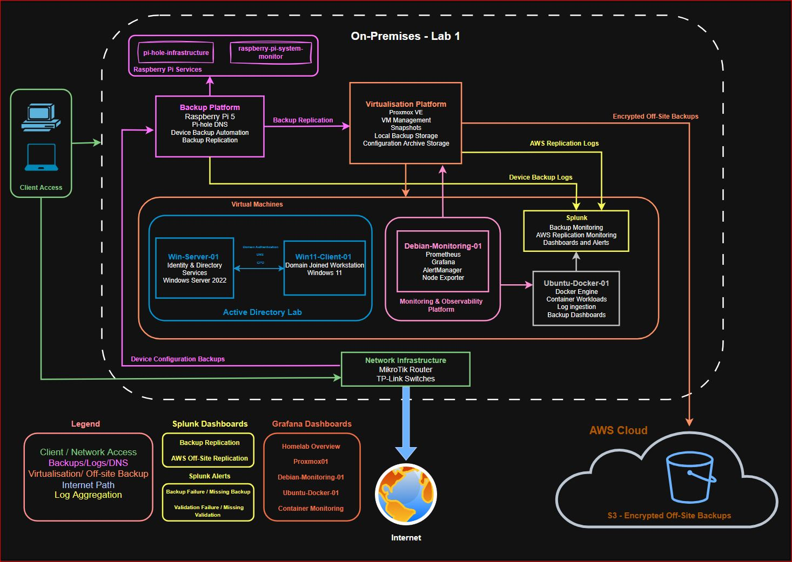

### Current VLAN Segmented Network Topology (V2)

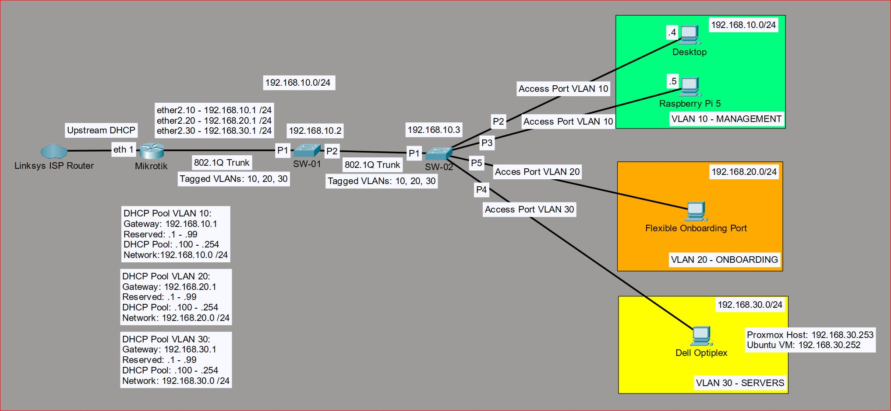

Additional deployment diagrams:

- [VLAN Segmented Topology V1](docs/diagrams/vlan-segmented-topology.PNG)
- [Initial MikroTik Deployment](docs/diagrams/initial-mikrotik-deployment.png)  
- [Managed Switch Deployment](docs/diagrams/managed-switch-deployment.png)

## Deployment Strategy

Use a staged rollout approach to:  

- Minimise disruption to the existing home network  
- Validate configurations incrementally  
- Maintain operational stability  
- Support isolated testing and troubleshooting  
- Simulate real-world infrastructure deployment practices

---
## 🖥️ Current Infrastructure

### Hardware

- Raspberry Pi 5
- MikroTik RB760iGS Router
- 2x TP-Link TL-SG605E Managed Switches
- Dell OptiPlex 3040
- HP t640 Thin Client
- ESP32 Development Kit
- Desktop Workstation
- Laptop Test Device

### Core Technologies

- Grafana  
- Prometheus  
- Pi-hole  
- Docker  
- Docker Compose
- Splunk  
- Proxmox VE  
- Windows Server 2022  
- Active Directory Domain Services 
- MikroTik RouterOS  
- Python  
- AWS S3
- AWS IAM
- AWS CloudWatch

---
## 🌐 Network Design

#### Network Overview

- The lab network is built around a MikroTik RB760iGS router with 2x TP-Link TL-SG605E Managed Switches
- The lab uses "Router on a Stick" (ROAS) with managed L2 switching and VLAN segmentation
- 802.1Q VLAN trunking between managed switches
- Dedicated DHCP scopes per VLAN
- VLAN 10 - Main (trusted devices) 
- VLAN 20 - Isolated (new device onboarding)
- VLAN 30 - Servers
- Automated MikroTik configuration backup to support rollback and recovery of router
- Implemented dedicated management subnet for router and switch configurations

#### Network Security & Hardening

- Restricted WinBox and SSH administrative access to the trusted management VLAN only
- Restricted access from onboarding vlan to management vlan while still preserving DNS, DHCP and internet connectivity
- Enforced inter-vlan isolation using MikroTik firewall filtering rules
- Hardened management-plane exposure by restricting MikroTik Neighbor Discovery and MAC-based management services
- Disabled unnecessary legacy management services including Telnet and FTP
- Maintained isolated lab environment separated from the primary home network infrastructure

####  Network Goals

- Separate trusted infrastructure from newly onboarded and testing devices
- Reduce risk when onboarding used or untrusted hardware into the lab
- Simulate enterprise-style network segmentation
- Support future virtualisation and security tooling
- Maintain operational stability of both home network and lab network during staged infrastructure changes

#### Operational Approach

- Implement changes to lab network using a staged deployment methodology to minimise potential disruptions
- Maintain rollback capability with configuration backups before major infrastructure changes
- Ensure management recovery paths always remain available during testing and troubleshooting
- Validate network segmentation and firewall policy using endpoint testing before wider deployment
- Maintain a dedicated onboarding network for isolated device testing and validation

#### Validation & Testing

- Validated DHCP scope assignment and internet connectivity across segmented VLAN infrastructure
- Confirmed inter-switch 802.1Q VLAN propagation across managed switch trunk links
- Performed endpoint isolation testing between trusted and onboarding VLANs
- Validated firewall policy enforcement through staged reachability and management access testing
- Confirmed onboarding VLAN devices retained DNS, DHCP and internet access while management-plane access remained restricted
- Tested management recovery procedures and rollback workflows before applying major infrastructure changes
- Verified automated MikroTik configuration backup scheduling, export generation and local backup retention workflows

---
## 💻 Virtualisation Platform

The lab uses Proxmox VE as the primary virtualisation platform running on a Dell OptiPlex 3040

### Node Summary 
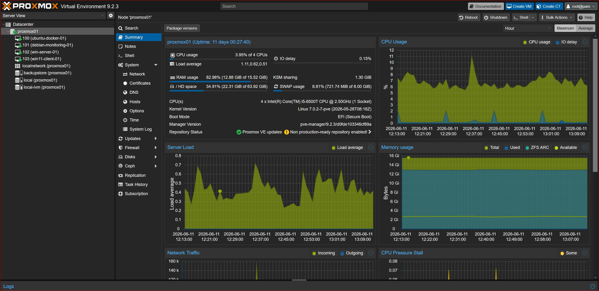
Proxmox VE host summary showing resource utilisation and health of the virtualization platform

### Lab Virtual Machines

#### proxmox01 

- Proxmox VE hypervisor
- Hosts all virtualised lab workloads
- Monitored using Prometheus, Grafana and Node Exporter

#### debian-monitoring-01

Dedicated observability platform providing:

- Grafana
- Prometheus
- Node Exporter
- cAdvisor
  
#### ubuntu-docker-01

Docker workload host providing:

- Docker Engine
- Docker Compose
- Containerised application deployment
- Container-level monitoring via cAdvisor
  
#### win-server-01

Windows Server 2022 domain controller providing:

- Active Directory Domain Services  
- DNS services  
- Group Policy management  
- User and computer authentication  
- Identity and access management
  
#### win11-client-01

Domain-joined Windows 11 workstation providing:

- Active Directory authentication testing  
- Group Policy validation  
- Domain user access testing  
- Enterprise endpoint simulation

### Datacenter View 
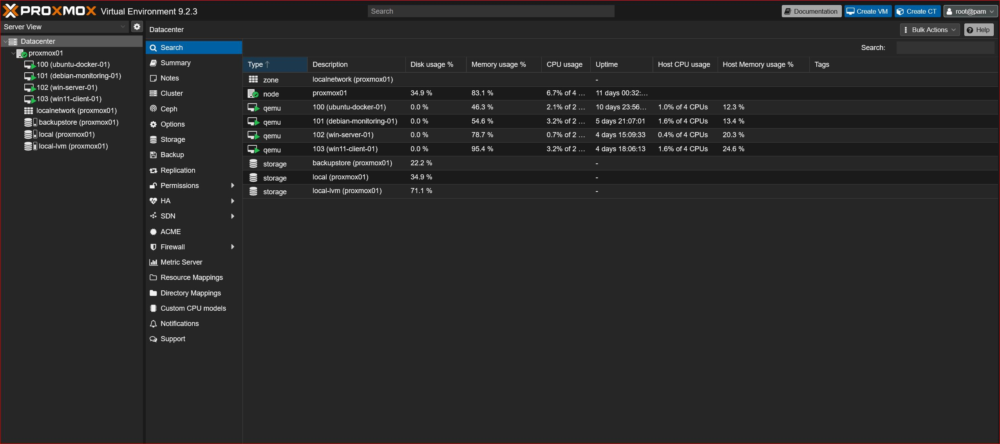
Proxmox VE datacenter view showing Linux and Windows virtual machines hosted within the lab.

---
## 🏢 Active Directory & Windows Administration

Windows Server 2022 domain controller deployed to introduce Microsoft enterprise infrastructure concepts

The environment provides:

- Active Directory Domain Services
- DNS services
- Organisational Unit (OU) management
- Group Policy administration
- Centralised authentication and identity management

Domain: lab.local
Domain Controller: win-server-01
Client: win11-client-01

Client joined to domain helping to validate:
- Domain authentication
- DNS functionality
- Group policy application
- User and computer management workflows

### Organisational Unit Structure
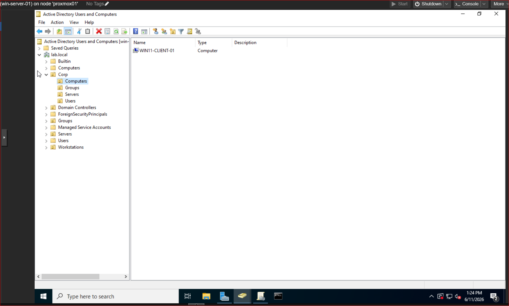

### User Management
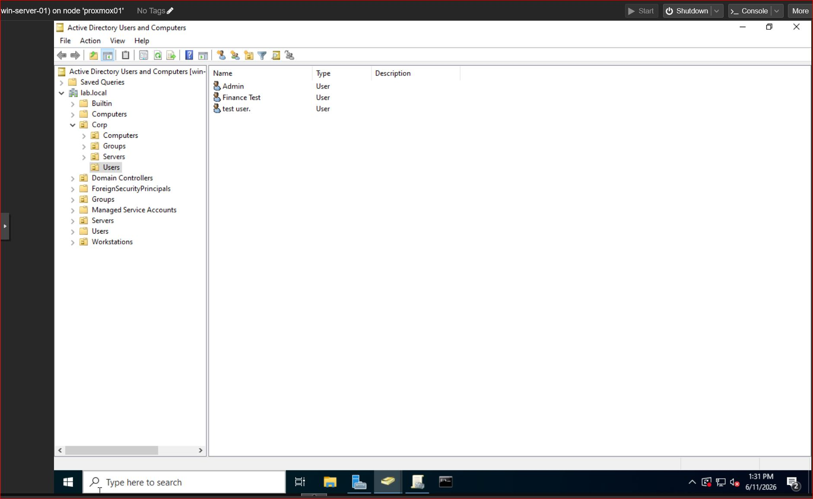

### Security Groups 
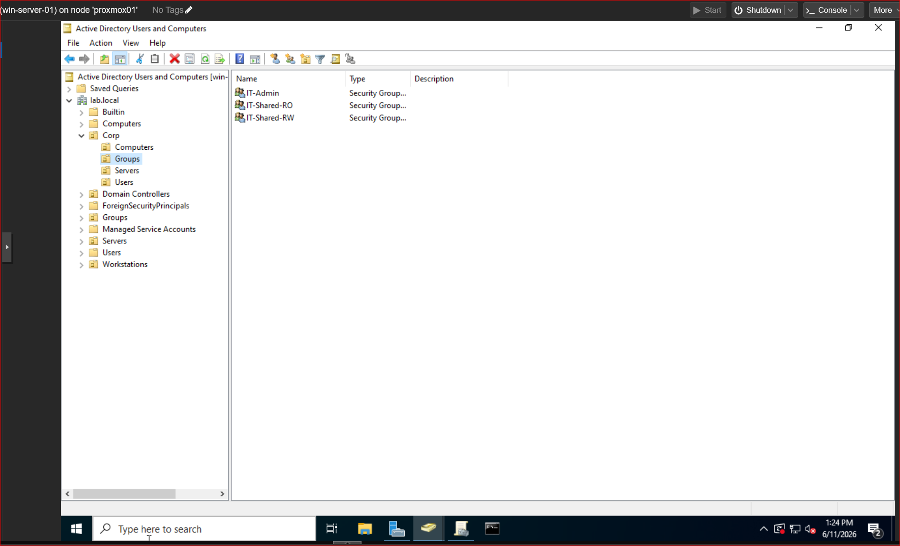

### DNS Services
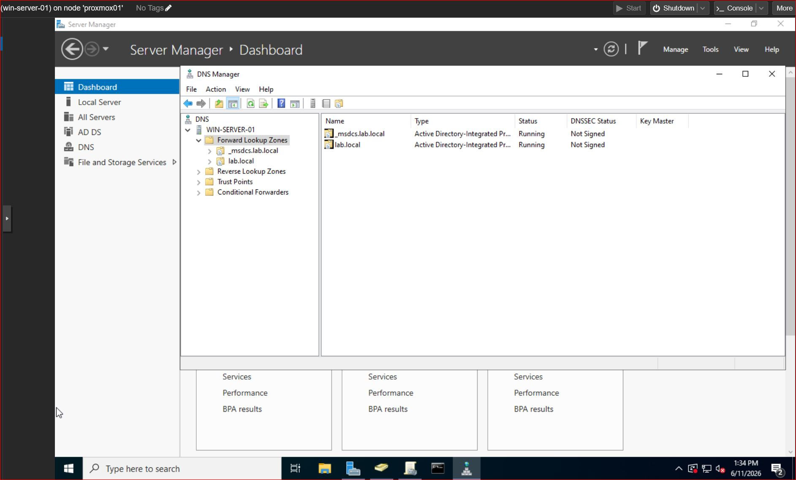

### Group Policy Management 
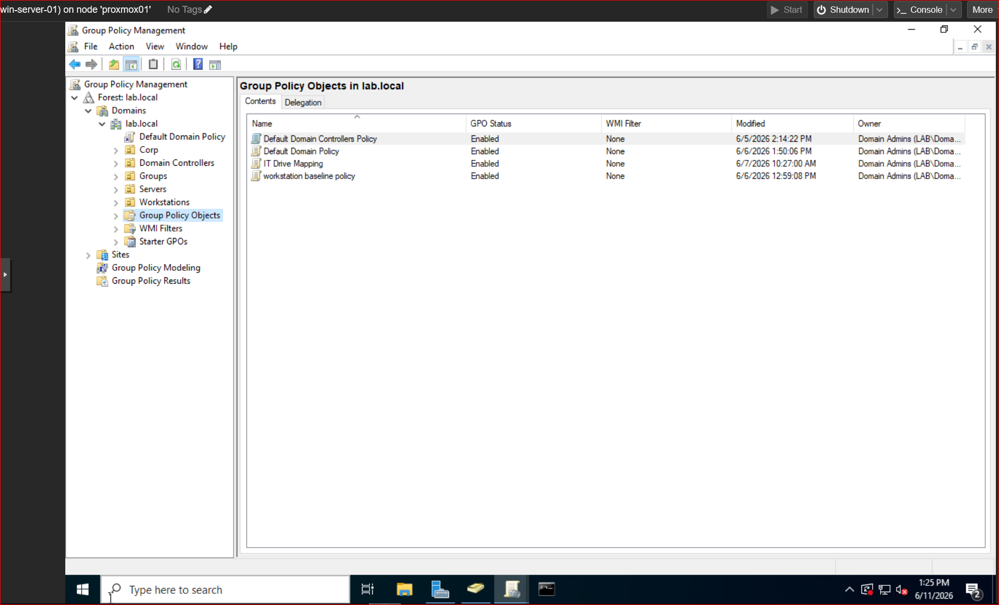

---
## 📈 Monitoring & Observability

The lab includes a dedicated observability platform running on a Debian virtual machine hosted on Proxmox VE.

### Observability Stack

- Prometheus
- Grafana
- Node Exporter
- cAdvisor

### Monitoring Coverage

#### Proxmox Host

- CPU utilisation
- Memory utilisation
- Disk utilisation
- Network throughput
- System uptime
- System load

#### Virtual Machines

- debian-monitoring-01
- ubuntu-docker-01

Metrics collected:

- CPU utilisation
- Memory utilisation
- Disk utilisation
- Network throughput
- System uptime
- System load

#### Containers

Container-level monitoring is provided through cAdvisor.

Metrics collected:

- Container CPU utilisation
- Container memory utilisation
- Container status and availability

### Grafana Dashboards

- Homelab Overview
- proxmox01 Dashboard
- debian-monitoring-01 Dashboard
- ubuntu-docker-01 Dashboard
- Container Monitoring Dashboard

#### Homelab Overview
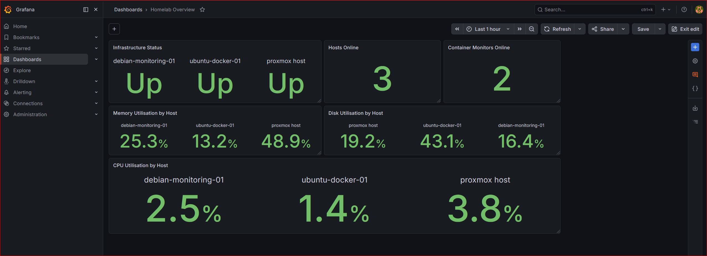

#### Container Monitoring
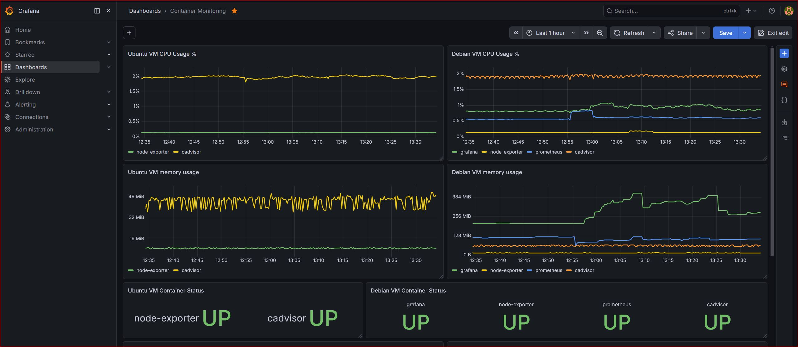

#### Proxmox Host Monitoring
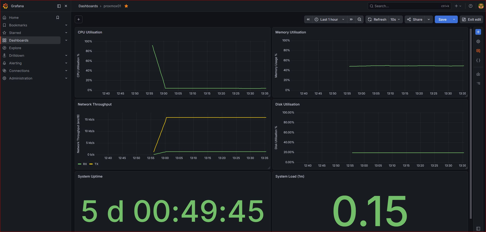

### Splunk Log Monitoring & Alerting 

Splunk added to provide centralised log monitoring for the automated backup and recovery platform.

Structured JSONL backup and validation logs are ingested into Splunk from the backup repository and used to monitor backup health across expected devices.

#### Backup Platform Overview Dashboard

Provides visibility of:

- Expected monitored backup devices
- Backup failures within the weekly backup window
- Validation failures within the weekly backup window
- Missing backups where an expected device has not produced a successful backup event
- Missing validations where an expected device has not produced a successful validation event
- Per-device backup status, validation status, backup age, validation age and latest backup/validation timestamps

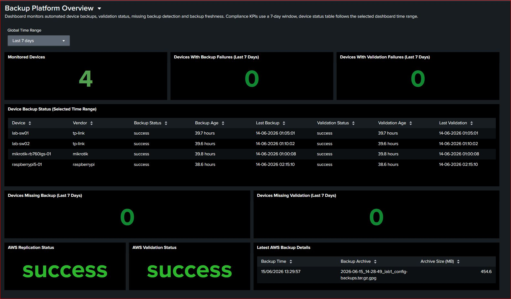

#### AWS Offsite Replication Dashboard

Provides visibility of:

- AWS replication status
- AWS validation status
- Backup freshness
- Replication success history
- Backup growth trends
- Latest backup archive details

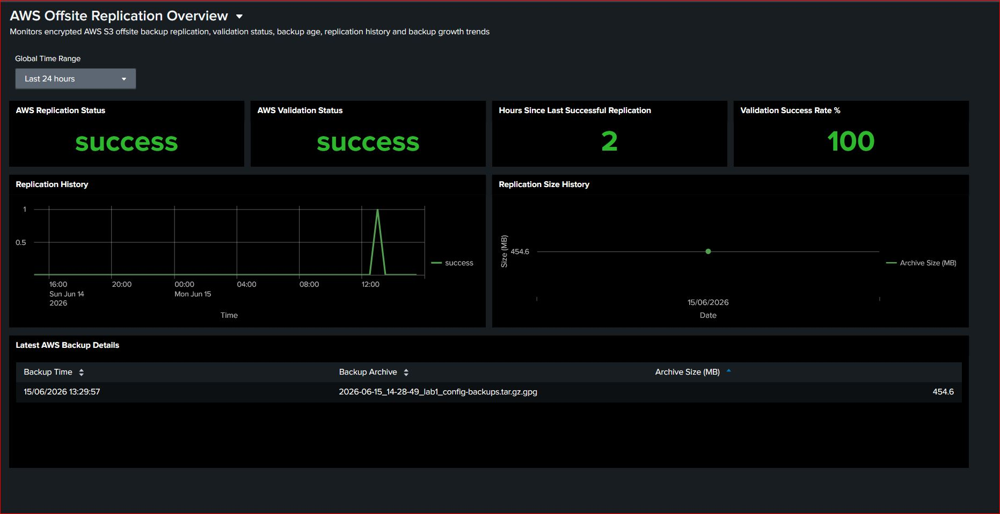

#### Scheduled Alerts

Scheduled alerts are configured to detect:

- Backup failure or missing successful backup
- Validation failure or missing successful validation

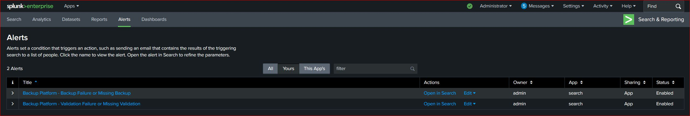

---
## 💾 Backup & Recovery Automation

A backup and recovery platform developed to protect network devices and critical services
  
Current coverage includes:  
  
- MikroTik router configuration backups  
- TP-Link switch configuration backups  
- Raspberry Pi system configuration backups  
- Backup validation and integrity testing  
- Repository replication and verification  
- Structured JSONL operational logging
- AWS S3 encrypted offsite backup replication
- Backup replication validation
- Offsite backup monitoring
  
Backups are stored locally before being replicated to secondary storage for recovery purposes
  
The platform was designed to provide hands-on experience with automation, validation workflows, backup management, operational logging and disaster recovery concepts

### AWS Offsite Replication

To support a 3-2-1 backup strategy, the backup repository is replicated from Proxmox host to AWS S3, replication and validation logs are generated by this process which are ingested into Splunk

Replication workflow:

1. Repository archive creation
2. GPG AES-256 encryption
3. SHA256 checksum generation
4. AWS S3 upload
5. Object validation using AWS metadata
6. Structured JSONL logging
7. Splunk dashboard monitoring

---
## 🔍 Issues & Troubleshooting

#### VLAN & Network Segmentation  
  
- Diagnosed and resolved MikroTik VLAN deployment issue where DNS and management traffic were being blocked by firewall interface-list behaviour
- Resolved temporary management lockout during VLAN migration by using direct recovery access
- Diagnosed switch management connectivity issues caused by legacy pre-VLAN management addressing and corrected device configuration
- Diagnosed inter-VLAN management reachability behaviour and implemented MikroTik firewall filter rules to enforce onboarding VLAN isolation 

#### Management Plane Hardening  
  
- Identified that MikroTik MAC-based management and Neighbor Discovery services could bypass Layer 3 firewall isolation during Onboarding VLAN testing

#### Server Network Deployment  
  
- Diagnosed VLAN30 connectivity failure caused by SW02 Port 4 retaining its VLAN20 PVID after being reassigned as an untagged VLAN30 access port
- Updated Proxmox host network configuration after identifying that the host retained its VLAN20 addressing following migration to the VLAN30 server network
- Reconfigured Ubuntu Server VM networking after identifying that the VM retained its previous VLAN20 DHCP lease after the Proxmox bridge moved to VLAN30  

#### Firewall & Connectivity Validation  
  
- Diagnosed inter-VLAN firewall rule ordering issue where VLAN30 return traffic to VLAN10 was dropped before established and related traffic was accepted
- Diagnosed inter-VLAN connectivity issues by distinguishing MikroTik input-chain gateway traffic from forward-chain host traffic during firewall validation
- Identified local Windows firewall behaviour as the cause of VLAN20 laptop ICMP reachability issues after validating MikroTik routing, VLAN tagging and firewall policy

#### Backup, Logging & Splunk Monitoring

- Standardised backup completion logging across Raspberry Pi, MikroTik and TP-Link backup workflows after identifying inconsistent stage naming between scripts

#### Active Directory & Access Validation

- Fixed incorrect file share permission behaviour caused by cached Kerberos access tokens and resolved validation by purging tickets and re-authenticating

---
## 🚀 Roadmap

- [X] MikroTik core routing
- [X] Managed switch uplinks and trunking
- [X] VLAN segmentation
- [X] Monitoring and observability platform
- [X] Proxmox virtualisation platform
- [x] Windows Server Active Directory
- [x] Backup and recovery platform
- [X] Centralised logging and alerting with Splunk
- [X] 3-2-1 backup strategy implementation
- [X] AWS S3 backup validation
- [ ] AWS S3 disaster recovery restore testing
- [ ] Backup archive retention policies
- [ ] Wireless infrastructure deployment
- [ ] Security monitoring platform deployment
- [ ] Lab 2 network expansion
- [ ] Site-to-site VPN between Lab 1 and Lab 2
- [ ] Infrastructure as Code (Terraform)
- [ ] Configuration management (Ansible)

---
## 🔗 Related Projects

- [raspberry-pi-system-monitor](https://github.com/Am1tp/raspberry-pi-system-monitor)
- [pihole-infrastructure](https://github.com/Am1tp/pihole-infrastructure)

